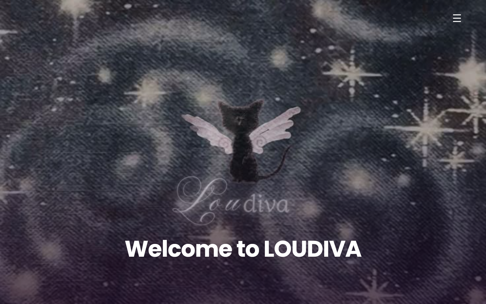
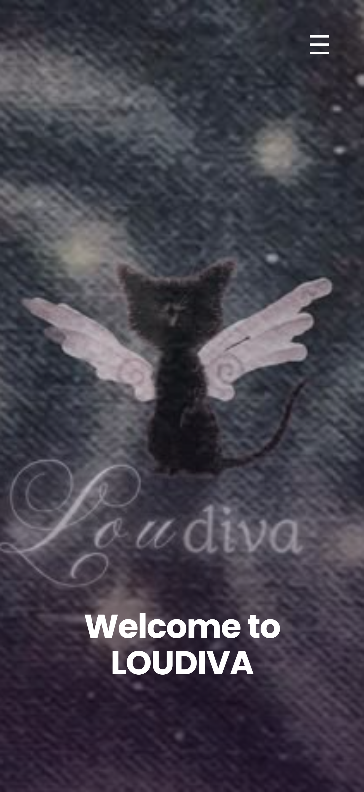

# LOUDIVA

Proyek tugas mata kuliah Pemrograman Web berupa halaman artist management yang menampilkan dua artis, yaitu Lisa dan IVE. Struktur tata letak dan gaya visual pada proyek ini mengacu pada desain situs [lloud.co](https://www.lloud.co), kemudian dimodifikasi untuk memenuhi ketentuan tugas, meliputi perubahan nama menjadi LOUDIVA, penambahan artis IVE, serta penyesuaian pada bagian konten dan fungsi lainnya.

Tautan demo: [link website](https://razshelia.github.io/loudiva/)

## Tangkapan Layar

Tampilan Desktop:

Tampilan Tablet:

Tampilan Mobile:

## Penjelasan Singkat

Halaman ini dibangun sebagai single page, dengan seluruh bagian konten disusun secara vertikal dan dapat diakses melalui menu navigasi di pojok kanan atas. Bagian-bagian yang terdapat pada halaman ini adalah sebagai berikut.

- **Hero** — bagian pembuka berisi judul LOUDIVA dengan foto latar
- **Banner promosi** — menampilkan rilisan terbaru dari Lisa dan IVE
- **About** — penjelasan singkat mengenai LOUDIVA
- **Artist** — profil Lisa dan IVE
- **Projects** — kumpulan proyek yang bisa di klik
- **Contact** — formulir subscribe
(ini mengikuti bagian-bagian di website yang saya tiru)

## Pemenuhan Ketentuan Tugas

**Wajib responsive (mobile, tablet, desktop)**
Telah diterapkan menggunakan breakpoint pada lebar 768px. Di bawah breakpoint, elemen disusun 1-2 kolom; di atasnya, tata letak berubah menjadi grid dengan kolom lebih banyak.
 
**Menerapkan HTML, CSS, dan JavaScript (DOM)**
Telah diterapkan. HTML untuk struktur, CSS pada `style.css`, dan JavaScript (`script.js`) untuk membuat konten dinamis seperti kartu proyek dan slideshow, serta menangani menu, scroll, dan validasi form.
 
**Menggunakan Plain CSS (tanpa Tailwind/Bootstrap)**
Telah diterapkan. Seluruh gaya ditulis manual di `style.css` tanpa framework CSS apa pun.

## Catatan Tambahan
Formulir subscribe pada bagian bawah halaman saat ini masih berupa simulasi, hanya sebatas menampilkan notifikasi berhasil, tanpa terhubung ke basis data maupun layanan email apa pun.